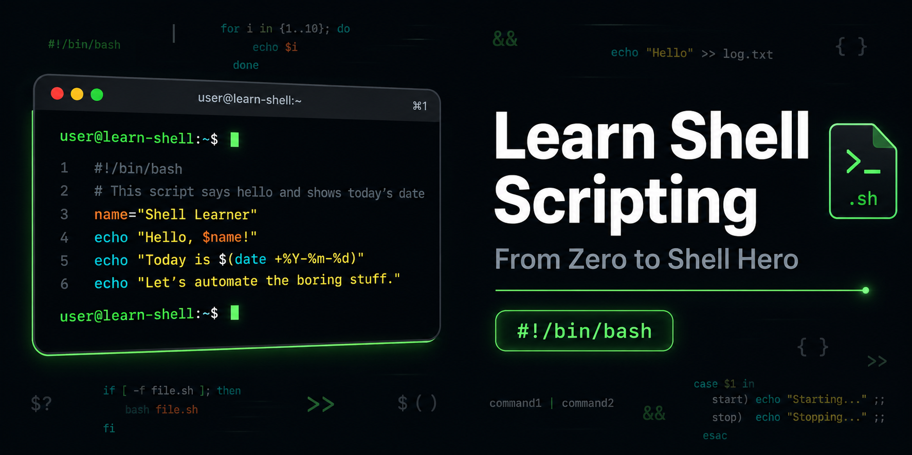

# Learn Shell Scripting

This repository is used to learn, practice, and document a shell scripting course. The content is organized into sections covering an introduction to Bash, basic shell scripting concepts, and variables.

## Project Structure

- `1. Introduction/`
  - `ZTM_Bash_Module1_Ep1.md`

- `2. Section 01 Intro to Bash Shell Scripting/`
  - `ZTM_Bash_Module2_S01_Ep1_Aliases.md`
  - `ZTM_Bash_Module2_S01_Ep3_Shell_and_Scripts.md`
  - `ZTM_Bash_Module2_S01_Ep4_First_Script_and_PATH.md`
  - `ZTM_Bash_Module2_S01_Ep6_Shebang.md`
  - `ZTM_Bash_Module2_S01_Ep7_Comments.md`
  - `ZTM_Bash_Module2_S01_Ep8_Running_Scripts.md`

- `3. Section 02 Variables/`
  - `ZTM_Bash_Module2_S02_Ep1_Variables.md`
  - `ZTM_Bash_Module2_S02_Ep2_Variable_Expansion_Quoting.md`
  - `ZTM_Bash_Module2_S02_Ep3_Environment_Variables.md`
  - `ZTM_Bash_Module2_S02_Ep4_Getting_User_Input.md`

## How to Use

Open the Markdown files in your favorite editor or viewer to read the lessons. Each file corresponds to a learning episode from the Bash scripting course.

## Notes

- The repository is designed as a personal reference for Bash scripting fundamentals.
- Files are grouped by module and lesson for easy navigation.

## License

This repository does not include a license file. Add one if you want to define reuse permissions.
